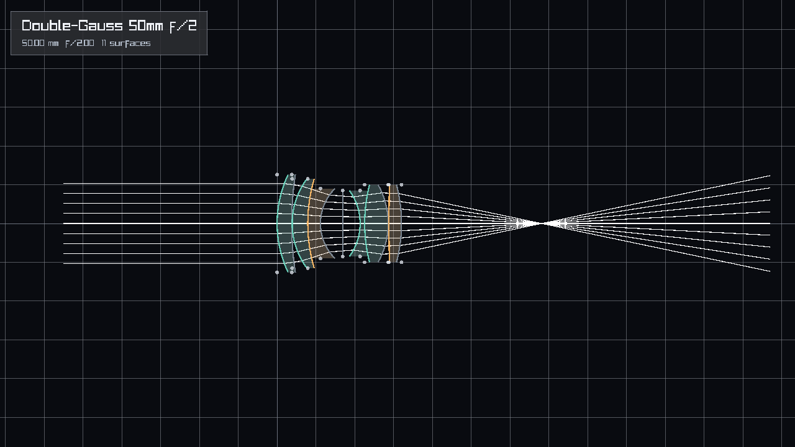
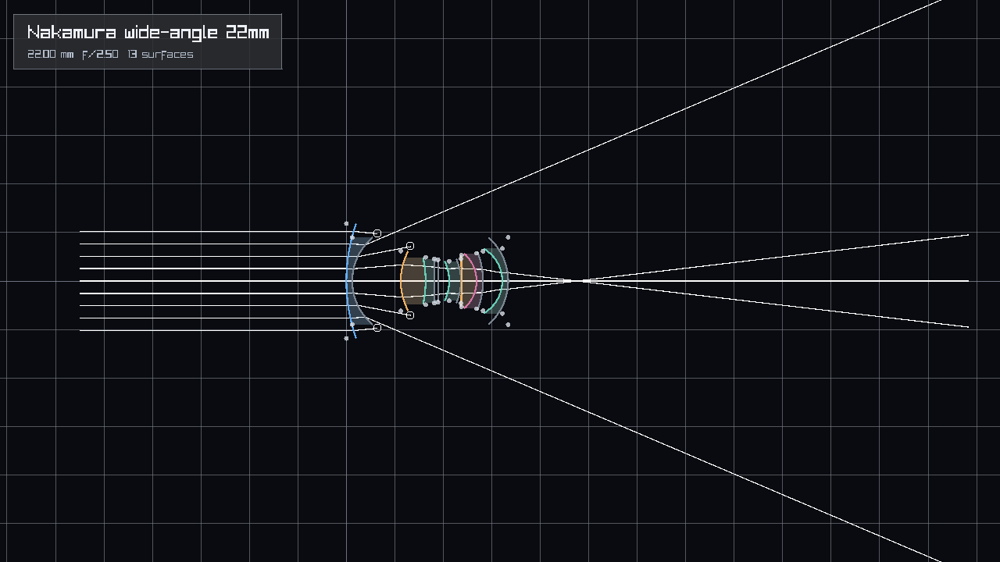
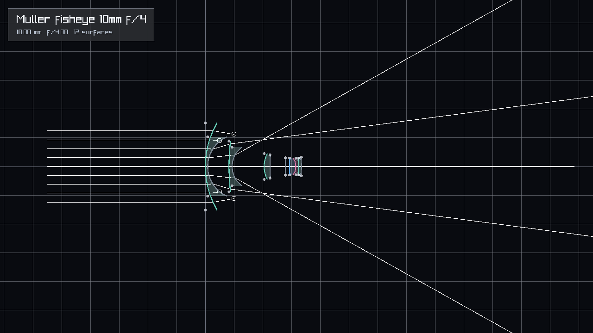
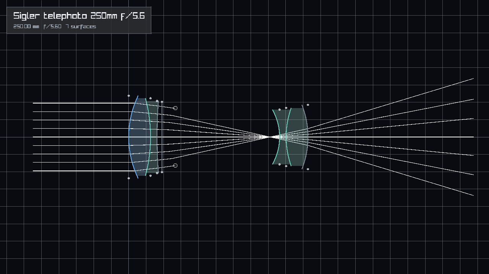
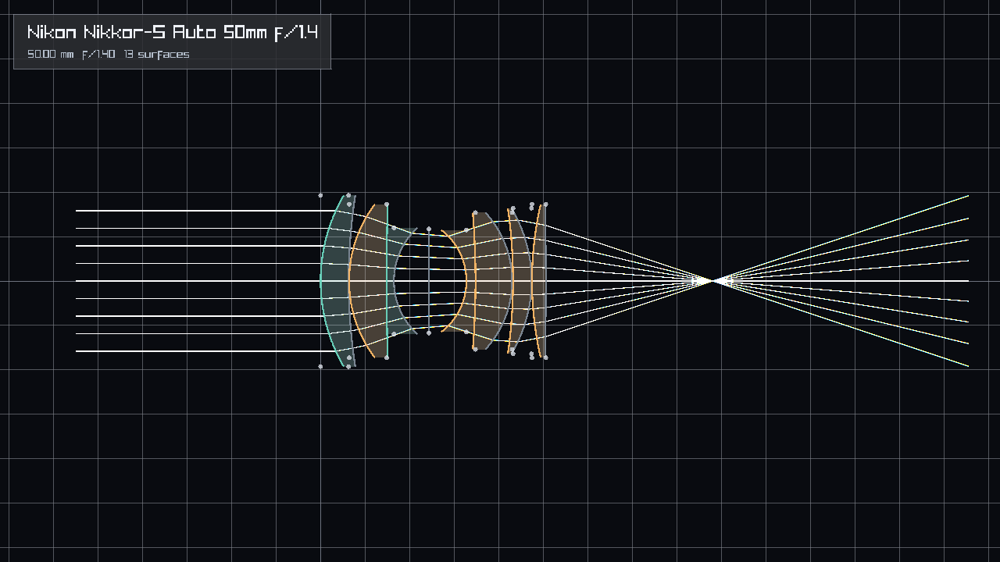
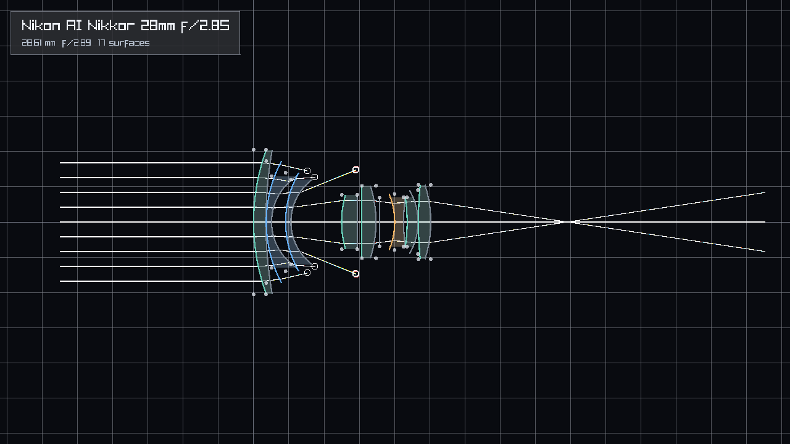
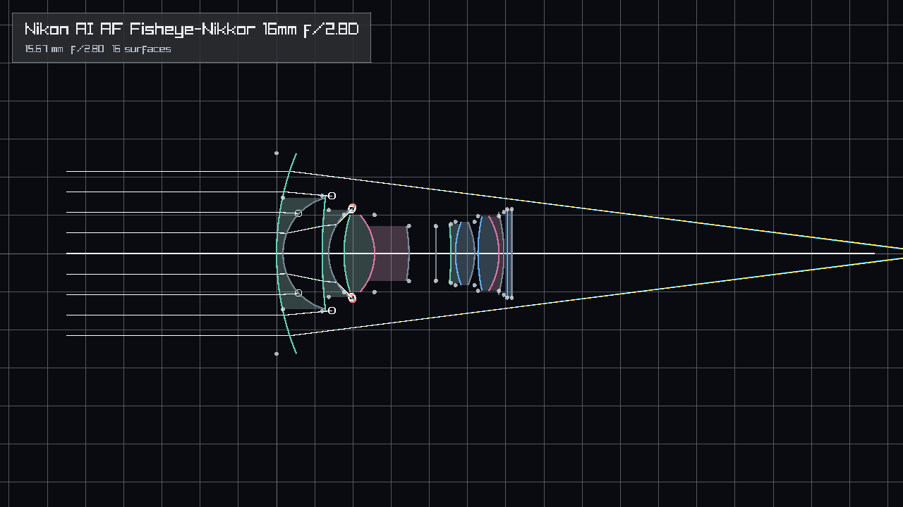
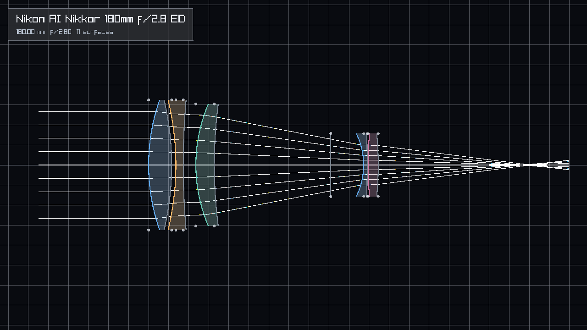

# opsys

`opsys` is a small header-only C++23 optical-system library. It traces rays through fixed optical systems made from value-type surfaces, mediums, and sagitta models. The current implementation favors compile-time-known data, pure free functions, copied medium structs, and analytic plane/conic intersections instead of runtime lookup tables or inheritance-heavy object models.

The repository also includes a raylib editor for inspecting and tweaking optical prescriptions. The editor can export deterministic PNG visualizations for every fixed preset.

## What is included

- Header-only `opsys` library under `include/opsys`.
- Value-based `Medium`, `OpticalSurface`, and `OpticalSystem` types.
- External ray support through the `opsys::RayLike` concept.
- `PlaneSagitta` and `ConicSagitta` surface models.
- Fixed compile-time optical preset tables in `include/opsys/presets.hpp`.
- Spectral ray tracing with wavelength-dependent medium indices.
- Optional raylib editor target, `opsys_editor`.
- Tests for tracing, preset copying, and medium dispersion.

## Build

```sh
cmake -S . -B cmake-build-debug
cmake --build cmake-build-debug
ctest --test-dir cmake-build-debug --output-on-failure
```

If raylib is available, CMake also builds the editor:

```sh
./cmake-build-debug/opsys_editor
```

Export the preset gallery:

```sh
./cmake-build-debug/opsys_editor --export-presets docs/presets
```

## Minimal use

```cpp
#include <opsys/opsys.hpp>

struct MyRay {
    double ox{};
    double oy{};
    double oz{};
    double dx{};
    double dy{};
    double dz{};
    double wavelength{};
};

int main() {
    const opsys::OpticalSystem system = opsys::optical_system(opsys::OpticalPresetId::double_gauss_50mm_f2);
    const MyRay ray{
        .ox = 0.0,
        .oy = 2.0,
        .oz = -40.0,
        .dx = 0.0,
        .dy = 0.0,
        .dz = 1.0,
        .wavelength = 550.0,
    };

    const opsys::TraceResult<MyRay> result = opsys::trace(system, ray);
    return result.status == opsys::TraceStatus::ok ? 0 : 1;
}
```

`MyRay` can be any caller-owned type with mutable `ox`, `oy`, `oz`, `dx`, `dy`, `dz`, and `wavelength` fields convertible to `double`.

## Fixed preset gallery

| Preset | Visualization |
| --- | --- |
| Double-Gauss 50mm f/2 |  |
| Nakamura wide-angle 22mm |  |
| Muller fisheye 10mm f/4 |  |
| Sigler telephoto 250mm f/5.6 |  |
| Nikon Nikkor-S Auto 50mm f/1.4 |  |
| Nikon AI Nikkor 28mm f/2.8S |  |
| Nikon AI AF Fisheye-Nikkor 16mm f/2.8D |  |
| Nikon AI Nikkor 180mm f/2.8 ED |  |

## Design constraints

`opsys` deliberately avoids runtime OOP. Mediums and surfaces are small copied values, preset prescriptions are fixed tables, and tracing reads the optical system directly. Dynamic catalogs and runtime prescription loading can be added later as a separate layer without changing the core value-oriented tracing path.
